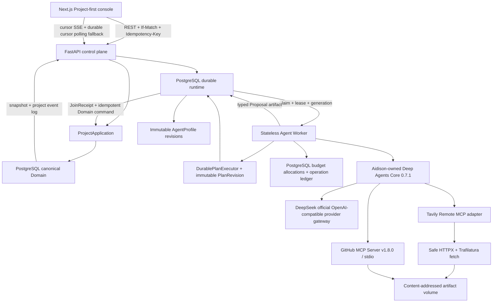

# Aidison Architecture

- Status: active development；通用 durable planner/executor、三种 durable JoinPolicy、scoped EffectApproval、receipt-aware recovery、不可变 AgentProfile、耐久预算账本与 PostgreSQL signal wake 已落地
- Decisions: [ADR-0001](adr/0001-single-runtime-durable-agent-delegation.md), [ADR-0002](adr/0002-seven-layer-governed-memory.md), [ADR-0003](adr/0003-postgresql-durable-state-with-notify-wake.md), [ADR-0004](adr/0004-generic-durable-plan-executor.md), [ADR-0005](adr/0005-deterministic-durable-join-closure.md), [ADR-0006](adr/0006-scoped-effect-approval-before-external-side-effects.md)
- Upstream lineage: [UPSTREAM_MAP.md](../UPSTREAM_MAP.md)

## Verified runtime structure

`compose.yaml` 运行 `web`、`api`、`worker`、`postgres` 四个长期服务，并用一次性 `migrate` 服务执行 Alembic。`api`、`worker`、`migrate` 共用同一 `aidison-backend:local` 镜像，避免服务镜像版本漂移；GitHub Key 只注入 `worker`。V0 没有 Redis、Celery、Dapr、Kubernetes、向量数据库、图数据库或第二 Agent runtime。

## Repository boundaries

| Boundary | Verified responsibility |
|---|---|
| `src/aidison/domain` | 不可变领域模型与状态枚举。 |
| `src/aidison/application` | canonical command、receipt、basis/CAS 规则、业务 Worker 与通用 `DurablePlanExecutor`。 |
| `src/aidison/research` | Research 专属 mode、gap、shadow-plan policy；不反向污染通用 planning contract。 |
| `src/aidison/artifacts` | content-addressed Artifact 的 typed metadata/status 契约。 |
| `src/aidison/infrastructure` | PostgreSQL Domain/runtime repository、ORM、content-addressed Artifact。 |
| `src/aidison/api` | FastAPI command/query、ETag、错误 envelope、typed historical snapshot normalization 和 cursor SSE。 |
| `src/aidison/agents` | typed Research Proposal 契约与受限 Deep Agent 组装。 |
| `src/aidison/tools` | Tavily Remote MCP 与 GitHub 官方只读 MCP 薄适配、有界参数/结果/预算/Artifact 映射，以及已知 URL 的 SSRF/redirect/MIME/size/timeout 边界。 |
| `src/aidison/providers` | DeepSeek 官方 OpenAI-compatible 模型路由，以及 capability-aware shopping adapters；缺 Key 不降级。淘宝 adapter 仅支持搜索/推荐。 |
| `src/aidison/runtime` | Job、Attempt、Delegation、JoinPolicy/Receipt 与业务无关 PlanRevision/TaskNode 的 typed contracts。 |
| `src/aidison/operations` + `ops` | 只读 Artifact 一致性检查，以及 Windows/Docker PostgreSQL + Artifact 配对备份和隔离恢复。 |
| `packages/deepagents` | 固定 SHA 导入的 Deep Agents Core；Aidison Agent 构造已迁移到官方 `HarnessProfile`，vendor 暂仅保留 Windows filesystem 差异与完整回归基线。 |
| `web` | deep-agents-ui 派生的 Project-first 工程控制台。 |

## State ownership

| State | Canonical owner |
|---|---|
| Requirement、Evidence、Candidate、Decision、SolutionVersion、Observation、ImpactAnalysis、PatchSet | PostgreSQL Domain tables |
| PurchaseProposal、OfferSnapshot、EffectApproval、CheckoutHandoff | PostgreSQL Domain tables；EffectApproval 是一次性、不可变 scope 的外部副作用 gate |
| Job、Attempt、Delegation、JoinGroup、AttemptResult、JoinReceipt、lease/fencing/cancel | PostgreSQL runtime tables；唯一执行事实源 |
| PlanHead、immutable PlanRevision、Task/Edge、PlanPatch/ReplanReceipt | PostgreSQL planning tables；Task status 是 Job 的可重建投影 |
| AgentProfile definition/revision、active pointer、root Job binding manifest | PostgreSQL profile tables；active pointer 仅在创建新 root Job 时解析 |
| root token/tool cap、child allocation、每次物理 model/tool operation | PostgreSQL budget account/allocation/operation ledger |
| Project UI 进度与恢复 | PostgreSQL project events + snapshot；浏览器仅保存最近项目和 cursor 提示 |
| Agent 输出 | typed staged Proposal/Artifact；不能直接写 canonical Domain |
| Artifact bytes | Docker volume / local artifact root；PostgreSQL 保存 hash、metadata、lineage、status |
| Deep Agent/LangGraph state | 单次执行临时状态；Research Agent 显式关闭 native subagent、checkpointer 和 store |
| Mai | 由主控同步的可视化投影，不反向覆盖代码、测试、Domain 或 `team.json` |

V0 operational recovery uses a write-quiesced pair: `api` and `worker` are paused, a read-only PostgreSQL/Artifact integrity gate must pass, then a PostgreSQL custom dump and content-addressed bytes are copied with a SHA-256 manifest. Restore is deliberately limited to a new Compose project and rejects existing target containers/volumes; it cannot overwrite the active runtime. V0 retains all Artifact metadata and bytes and has no automatic expiry/deletion path.

## Durable research sequence

1. API 在已批准 RequirementRevision 的 basis 上幂等创建 root Job。
2. Worker 使用 `SKIP LOCKED`、lease、generation 和 token 领取 root Job。
3. root Job 同事务冻结 AgentProfile binding manifest 并创建 root BudgetAccount；replay 不再读取 active pointer。
4. 业务 planner 创建有界 PlanRevision；通用 executor 读取 ready frontier，校验 node/spec，并幂等创建最多八个 durable child Job、冻结 JoinPolicy、task→Job binding 与 child budget allocation；reclaim/retry 不重置 root cap。
5. child Deep Agent 通过官方 `HarnessProfile` 禁用通用 subagent 与非 allowlist 工具，并只接受 `structured_response`。revision 1/3 replay 只使用 `web_search`；revision 4 额外开放 `github_search_repositories`、`github_search_code`、`github_get_file_contents`。Tavily 和 GitHub 都由 `langchain-mcp-adapters==0.3.1` 接入；`mcp` 固定在 `>=1.24,<2`。
6. GitHub revision 4 在一次 Agent 调用期间保持一个 stdio session；官方 Server 固定为 `v1.8.0`/OCI digest，只允许三项 `readOnlyHint=true` 工具。子进程只获得 token、`GITHUB_READ_ONLY=1` 和精确 `GITHUB_TOOLS`，`GITHUB_TOOLSETS` 缺席。每次真实调用执行 reserve → dispatched → settled/released/ambiguous。
7. MCP 只返回有界结果。Tavily 候选 URL 由 HTTPX + Trafilatura 受控获取并写入 `web_snapshot`；GitHub 文本/JSON 在 256 KiB 上限内规范化并写入 `github_snapshot`。应用层只接受当前 attempt 下 `PRESENT` 且 `(source_url, snapshot_hash)` 匹配的两类 Artifact，再形成 EvidenceBinding。
8. `DurableJoinWaiter` 由事务内 PostgreSQL NOTIFY 唤醒；通知只降延迟，parent 始终重读 Join durable state。`ALL_REQUIRED`、`BOUNDED_PARTIAL` 与 `FIRST_VALID` 共享同一评估函数；FIRST_VALID winner 由完成时间和 UUID 确定性选择。关闭 Join 时在同一事务取消非 winner sibling、关闭 PlanTask，并回收或保守结算预算。parent 只读取 accepted Proposal refs，确定性合并并提交唯一 JoinReceipt。
9. 以 JoinGroup 派生的幂等键调用 canonical Domain command，最后 fenced completion。
10. late/stale result 被 quarantine；取消会关闭 open join 并传播到未终止 children。
11. parent lease 过期后，新 generation 会原子 supersede 旧 Attempt，并取消旧 open JoinGroup 与未终止 children。未 dispatch reservation 被释放；已 dispatch 未知调用转为 `ambiguous` 并保守全额计费。
12. 若旧 generation 已提交 JoinReceipt，新 parent 在严格加载当前 project basis 前查找唯一 committed join，复用原 merged Proposal Artifact，并以 `join_group_id`、`committed_at` 和确定性 UUID 重建相同 Domain payload。
13. canonical command 先检查稳定 idempotency receipt，因此 Domain 已提交但 parent 未完成时可返回原结果；当前 generation 最后完成 root，旧 generation 被 fencing 拒绝。Research N-way/gap、Solution proposal 与 Impact proposal 已复用同一个 `DurablePlanExecutor`。

Command payload 的 canonical hash 先把 Pydantic model、UUID、Enum 和 timestamp 转为语义 JSON。它不依赖 Python `repr` 或具体时区对象实现，保证 crash/JSON/数据库往返后等值 payload 仍命中同一 receipt。

## Scoped shopping effect sequence

1. READY PurchaseProposal 必须显式申请 `shopping.create_cart` EffectApproval；服务端根据 proposal、offer、active solution、provider 和当前 basis 计算 scope hash。
2. 本地 control plane 对相同 scope resolve 为 approved 或 denied；TTL 到期只能 expired，terminal gate 不能 reopen。
3. checkout 重新计算 scope，CAS `approved → consumed`，并在一个事务写 `PREPARED` CheckoutHandoff、event 与 command receipt。
4. 数据库提交后才调用 provider。相同 idempotency key replay 返回原 handoff且不重复 provider；不同 key 不能复用 consumed approval。
5. 当前通用 checkout 输出仍是 provider-hosted HTTPS handoff，不保存支付凭证、不自动付款。淘宝 V1 不参与该 effect sequence：它只有搜索 capability，handoff capability 为空，所有 cart/redirect/checkout 调用都会 fail closed。

## Remaining architecture work

- EffectApproval 当前 resolver 是本地单用户 control plane；生产化仍需认证主体、RBAC/双人审批策略和 actor audit，不能把当前 endpoint 描述成完整 IAM。
- Shopping 当前仍是同步 provider/domain service。淘宝已有 opt-in、search-only TOP adapter，可生成 UNKNOWN availability、短 TTL 的报价快照；两次获授权的真实只读请求（第二次在用户更新配置后）均验证到 TOP structured permission-denial（而非网络/MIME 错误），但物料搜索 scope 尚未对该 App 生效，商品 response envelope、价格解析和真实搜索仍为 `not_checked`。若要进入多智能体编排，需定义候选比较与报价快照的 Agent plan；淘宝购买能力不在当前产品范围。
- 稳定真实 Bailian structured output + Tavily Remote MCP + Artifact + Join + Domain 的四旋翼 live gate；一次完整业务闭环已成功，但重复运行仍受外部来源/Agent 工具行为波动影响。
- GitHub 单次公开文件读取、fake stdio 和 Artifact/hash 内核已验证；完整 Agent 是否稳定选择 GitHub 工具仍需纳入四旋翼 live gate，而不是增加无界重试。
- HarnessProfile 项目回归通过后仍需验证上游 Windows ripgrep 行为；在用户确认前不删除 `packages/deepagents`。
- 正式决定如何处置运行库中五条历史测试污染的 `present`/missing-byte Artifact 审计记录；在此之前运行库备份按设计 fail closed。
- Provider-side usage reconciliation 与 vendor bill 精确一致性仍为 `not_checked`；本地 ledger 采用上界 reservation 与 ambiguous 保守计费保证不超卖。
- LangSmith/Langfuse 仅作为可丢弃 observability；当前未接入，也不改变事实源。
