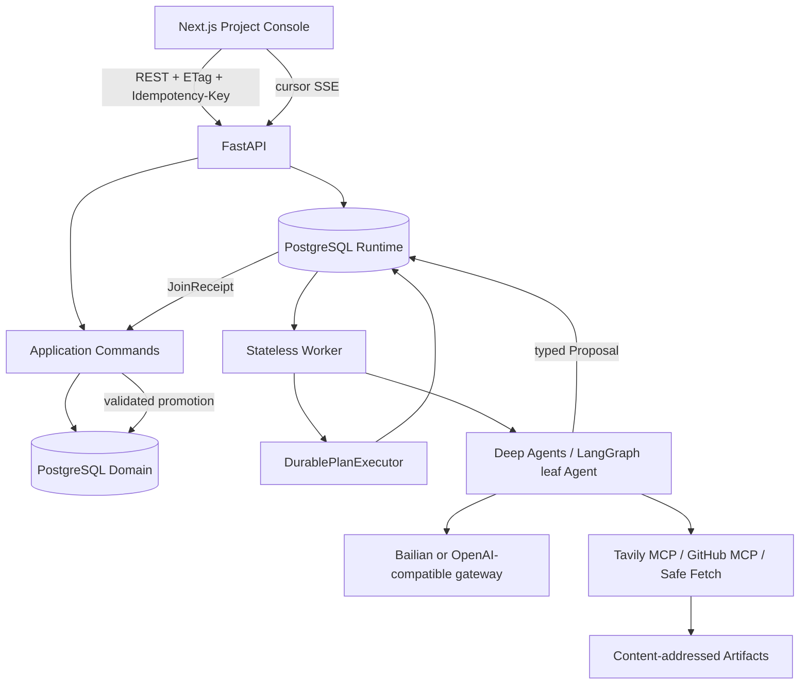

# 01. 项目架构

## 一句话定位

Aidison 是一个 local-first 的 DIY 工程决策 Agent：它把需求、证据、候选方案、人工决定、版本化 Solution 和外部操作授权保存为可审计事实，同时让多个 Agent 在可恢复、可限额的运行时中协作。

它不是“聊天 UI 加几个工具”，也不是“让多个 LLM 自由对话”。核心边界是：Agent 只提交 typed Proposal，只有应用层 Domain command 能改变项目事实。

## 系统分层

### 1. Domain 层

`src/aidison/domain` 保存 Requirement、Evidence、Candidate、Decision、SolutionVersion、Observation、PurchaseProposal、EffectApproval 等领域对象。它回答“项目现在认为什么是真的”。

关键规则：

- 项目写入用 revision/ETag 防止 stale write；
- command receipt 保证相同幂等键不会重复写业务事实；
- Agent 结果先是 Proposal，验证后才可晋升；
- 外部购买副作用需要独立 EffectApproval，不能复用普通业务 Decision。

### 2. Application 层

`src/aidison/application` 组织用例。`DurablePlanExecutor` 是业务无关的 parent sequencer，Research、Solution 等业务适配器负责定义任务、合并结果并调用 Domain command。

这层刻意不做两件事：不让 planner 直接改数据库领域事实；不让通用执行器理解 Research gap 或购物商品等业务概念。

### 3. Durable runtime

`PostgresRuntime` 管理 Job、Attempt、Delegation、JoinGroup、JoinReceipt、lease、generation fencing、取消和 late-result quarantine。`PostgresPlanStore` 管理不可变 PlanRevision、ready frontier、CAS replan 和 task→Job 投影。

PostgreSQL 是唯一权威状态。`LISTEN/NOTIFY` 只降低等待延迟，通知丢失后仍由数据库重读恢复。因此系统不需要 Redis/Celery 来充当第二事实源。

### 4. Worker 与叶子 Agent

Worker 是可丢弃进程：领取 Job、获得带 generation 的 claim、执行固定 Profile、登记结果。Deep Agents/LangGraph 位于单个 work item 内，负责模型循环、工具使用和 structured output；它们的 thread/graph state 不是项目或调度事实。

### 5. Artifact 与 Evidence

网页和 GitHub 内容先经过受控工具边界，再保存为 content-addressed Artifact，并通过 hash/EvidenceBinding 进入领域层。这样能回答“某个结论引用了哪一份具体内容”，而不是只保存一个可能变化的 URL。

### 6. Web/API

浏览器只读取 API DTO，不直接理解数据库或 LangGraph checkpoint。命令使用 `If-Match` 和 `Idempotency-Key`；事件流使用 durable cursor SSE，断线后可从 sequence 重放。

## 部署拓扑

`compose.yaml` 包含四个长期服务：`web`、`api`、`worker`、`postgres`；`migrate` 是一次性 Alembic 服务。`api`、`worker`、`migrate` 共用后端镜像，降低迁移和代码版本漂移。

当前没有 Redis、Celery、Dapr、Kubernetes、向量数据库、图数据库或第二套 Agent runtime。这是有意控制个人项目复杂度，不是能力声明。

## 一次多 Agent 执行的数据流

1. API 创建冻结 basis、Profile revision 和预算上限的 root Job。
2. Worker 用 lease/generation 领取 Job。
3. 业务 planner 生成 immutable PlanRevision；executor 读取 ready frontier。
4. executor 在同一事务创建 wave、child Jobs、预算 allocations 和 task bindings。
5. child Agent 使用受限工具并写 AttemptResult；旧 generation 的结果被拒绝或隔离。
6. JoinPolicy 决定何时收敛，事务同时取消不再需要的 sibling 并对账预算。
7. parent 读取唯一 JoinReceipt，合并 typed Proposal。
8. Application 校验 basis 和项目 revision，使用 command receipt 写入 Domain。

## 当前边界

- 已解决：动态编排不再只属于 Research；Research 和 Solution 复用通用 executor。
- 尚有限制：执行器当前处理有界 ready wave，不是任意深度自主 DAG scheduler。
- 购物已具备 Proposal、Offer、Approval、CheckoutHandoff 的安全边界，但没有真实淘宝 connector。
- live provider 闭环曾成功，但重复稳定性和厂商账单精确对账仍未完成。

继续阅读：[核心算法](02-core-algorithms.md)、[核心代码导读](06-core-code-walkthrough.md)、[ADR](../adr/0001-single-runtime-durable-agent-delegation.md)。
