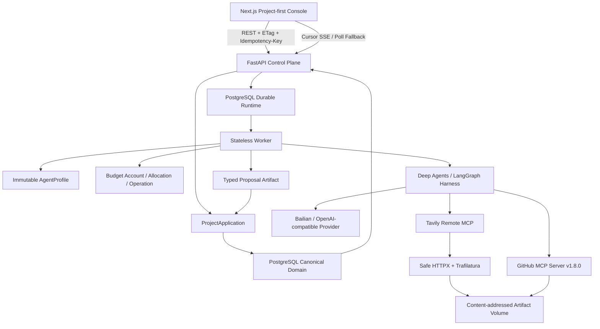

# 已实现系统架构

## 1. 运行结构



## 2. 仓库边界

| 路径 | 当前职责 |
|---|---|
| `src/aidison/domain` | 不可变业务模型、状态枚举和核心语义 |
| `src/aidison/application` | command、basis/CAS、receipt、Research/Solution/Impact 协调 |
| `src/aidison/runtime` | Job、Attempt、Delegation、JoinPolicy/Receipt contracts |
| `src/aidison/infrastructure` | PostgreSQL ORM/repository、budget、profile、Artifact store |
| `src/aidison/agents` | typed Proposal、AgentProfile 和受限 Deep Agent 构造 |
| `src/aidison/tools` | Tavily/HTTP 和 GitHub MCP 薄适配、安全/预算/Artifact 映射 |
| `src/aidison/providers` | Bailian/OpenAI-compatible 模型路由 |
| `src/aidison/api` | FastAPI command/query、snapshot、ETag、错误 envelope、SSE |
| `src/aidison/operations`、`ops` | Artifact 完整性、备份和隔离恢复 |
| `packages/deepagents` | 固定 SHA 的 Deep Agents Core 源码与回归基线 |
| `web` | Next.js Project-first 工程控制台 |
| `migrations/versions` | 7 个顺序 Alembic migration |
| `tests` | unit、integration、live 三层验证 |

## 3. 状态所有权

| 状态 | 唯一事实源 |
|---|---|
| Requirement、Module、Evidence、Candidate、Decision、Solution、Observation、Impact、Patch | PostgreSQL Domain 表 |
| Job、Attempt、Delegation、JoinGroup、JoinReceipt、lease、generation、cancel | PostgreSQL runtime 表 |
| AgentProfile revision、active pointer、Job binding | PostgreSQL profile 表 |
| token/tool cap、allocation、每次真实调用 | PostgreSQL budget ledger |
| 项目进度与浏览器恢复 | PostgreSQL project event + snapshot API |
| Agent 工作态 | 单次 LangGraph/Deep Agents 执行态，不是业务事实 |
| Artifact bytes | content-addressed 本地/Docker volume |
| Artifact metadata/hash/lineage | PostgreSQL |
| 可观测投影 | Mai、未来 LangSmith/Langfuse；都不能回写事实源 |

## 4. 多智能体分层

Aidison 刻意区分四个概念：

- Workflow：确定性的项目阶段、依赖、Gate、重试和暂停。
- Logical Agent：版本化能力与政策，例如 Research、Solution、Impact proposer。
- Deep Agents Subagent/worker：单个逻辑任务内的短时执行能力。
- Tool/MCP：搜索、读取网页、GitHub 或未来购物等被调用能力，不是 Agent。

耐久性由 Aidison Job runtime 负责，模型执行由 Deep Agents/LangGraph 负责。当前 Research parent 最多创建两个有身份的 durable child；child 不允许递归创建 child。每个结果都要经过 generation、basis、profile、预算、Artifact 和 cancel 校验后才能进入 JoinReceipt。

## 5. Research 执行序列

1. API 在已批准 `RequirementRevision` basis 上幂等创建 root Job。
2. Worker 使用 PostgreSQL `SKIP LOCKED`、lease、generation 和 claim token 领取任务。
3. root Job 冻结 AgentProfile binding，并创建 root BudgetAccount。
4. root 幂等创建最多两个 child Job、JoinPolicy 和 child allocation。
5. child 使用 frozen Profile 和 frozen prompt，调用受限 Agent harness。
6. revision 4 允许 `web_search + github_read`；revision 1/3 replay 不被升级。
7. Tavily 结果经安全 HTTP 获取并形成 `web_snapshot`；GitHub 结果形成 `github_snapshot`。
8. 应用只接收当前 Attempt 下 `PRESENT` 且 hash 匹配的 Artifact。
9. parent 只读取 accepted Proposal，确定性合并并提交唯一 JoinReceipt。
10. canonical command 使用确定性幂等键写入 Evidence、Candidate、Compatibility 和 Decision。
11. stale/late 结果进入 quarantine；旧 generation 无法反转终态。

## 6. Solution 与 Impact 序列

```text
Approved Decision
→ solution_wave / solution-proposer
→ staged SolutionProposal Artifact
→ Domain 校验模块、Candidate、Evidence、Compatibility 和 basis
→ 用户只提交 proposal_id + basis_hash
→ immutable SolutionVersion V1
→ Observation + direct affected hints
→ impact_wave / impact-proposer
→ deterministic dependency closure
→ ImpactAnalysis + proposed module patches
→ 用户只提交 impact_id + basis_hash
→ PatchSet + immutable SolutionVersion V2
```

V2 只替换受影响模块；未受影响模块的 snapshot identity/hash 原样复用。浏览器不能提交任意 BOM、步骤或 Patch。

## 7. AgentProfile 与预算

当前 Profile 包含：

- `research-worker-ro` revision 1、3、4；
- research orchestrator；
- `solution-proposer-ro` 与 orchestrator；
- `impact-proposer-ro` 与 orchestrator。

Profile 是不可变、内容寻址、可回放的能力配置，包含模型路由、prompt hash、tool/effect scope、memory scope、并发和预算上限。active pointer 只影响新 root Job。

预算采用三层：root account、child allocation、operation ledger。一次真实 model/tool 调用必须经过 `reserve → dispatched → settled/released/ambiguous`。调用是否计费与结果是否被 Domain 接纳是两个独立决定。

## 8. 七层记忆的实现边界

设计把记忆分为 Working、Episodic、Canonical Project、Evidence/Semantic、Preference、Procedural 和 Artifact。当前 V0 主要用 PostgreSQL、临时 Agent state 和 Artifact volume 实现这些所有权边界，没有创建七套数据库，也没有引入向量库。

关键原则是：模型草稿、provider conversation 和 checkpoint 不自动晋升为长期事实；Preference 只能来自用户显式输入；Procedural 规则只能由版本化 Profile/发布流程改变。

## 9. 部署拓扑

`compose.yaml` 当前包含：

- `postgres`：PostgreSQL 17，宿主端口 5432；
- `migrate`：一次性 Alembic 服务；
- `api`：FastAPI，宿主端口 8000；
- `worker`：无状态后台 worker；
- `web`：Next.js，宿主端口 3000。

`api`、`worker`、`migrate` 共用 `aidison-backend:local` 镜像。GitHub Key 只注入 worker，不进入 API 或 migrate。

