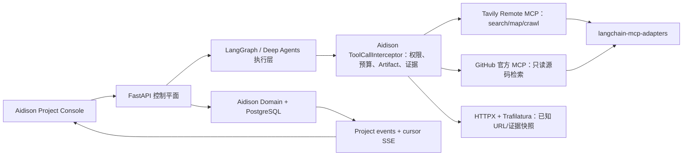

# Aidison 能力采购与所有权矩阵

## 决策规则

- `KEEP_OWNED`：体现 Aidison 产品不变量或面试价值，必须由项目自己拥有。
- `THIN_ADAPTER`：使用维护良好的 SDK/API/MCP/library，Aidison 只保留策略和数据映射。
- `DIRECT_REPLACE`：通过等价性验证门后，以成熟实现替换本地或 vendored 实现。
- `DELETE`：不可达、生成残留或无价值代码，不需要替代物。
- `DEFER`：以后有价值，但当前引入的生命周期、认证和状态成本高于收益。

## 总体架构

外部产品负责通用执行和访问能力，但不成为需求、决策、`SolutionVersion`、用户观察、影响分析、预算、证据或 Artifact 谱系的事实源。

## 信息源与搜索

| 能力 | 决策 | 当前采用 | Aidison 保留的边界 | 不采用/延期 |
|---|---|---|---|---|
| 全网搜索 | `THIN_ADAPTER` | Tavily Remote MCP，经 `langchain-mcp-adapters==0.3.1` 接入 | 查询/结果上限、reserve-dispatch-settle、provider-independent DTO、调用审计、MCP 结果 Artifact 与 EvidenceBinding | 不保留自写 `TavilySearchBackend`；MCP spike 通过后移除 `tavily-python` 产品路径 |
| 已知 URL 与正式证据页 | `KEEP_OWNED` + 成熟库 | HTTPX 下载 + Trafilatura 2.2 正文提取 | 在保存原始字节前强制 HTTPS/443、DNS/私网地址、redirect、MIME、字节数与 timeout 限制；记录 hash 和来源时间 | Jina Reader 是外部代理，不能替代原始字节谱系或本地 SSRF 边界；Markdownify 只负责 HTML→Markdown，不等于正文抽取 |
| Map/整站有限抓取 | `THIN_ADAPTER`，按需开放 | Tavily MCP 的 `map`/`crawl` | 只有规格出现真实多页需求时才把工具加入 profile；返回页面仍走 Artifact/证据路径 | 不自写 crawler；V0 不为了展示能力而默认开放 crawl |
| GitHub repository/code search | `THIN_ADAPTER` | GitHub MCP Server v1.8.0，`--read-only`、最小 repos 工具集；LangChain interceptor | 预算、tool allowlist、结果 Artifact、证据绑定；`GITHUB_API_KEY` 已配置，只在启动子进程/容器时映射为官方 server 所需变量，不复制持久化 | 不自写 GitHub Search API 客户端；REST/`gh` 只允许临时诊断，不形成第二套产品集成 |
| 多平台/社交/视频触达 | `DEFER` / 思想来源 | V0 不接入 | 借鉴 Agent-Reach 的 `doctor`：显示渠道可用性、当前 backend、最近错误与修复提示 | 不把 Agent-Reach 安装进产品；否则会引入 Cookie、多 CLI、Node 工具和宽泛 Skill 触发，却不能替代搜索后端 |

### Agent-Reach 的准确分类

`Panniantong/Agent-Reach` 在 commit `b4d52c46c9113cb0f653d6df4cf71ebadf4930ac`、v1.5.0 下包含 6,282 行 source Python 和 7,929 行测试。它是 15 个渠道的 installer/configurator/health checker：GitHub 渠道探测 `gh`，Exa 渠道探测 `mcporter`，网页渠道调用 Jina Reader，MCP server 只暴露状态。因此它是“集成健康设计的思想来源和可选开发工具”，不是 Aidison 的搜索框架、GitHub SDK 或 MCP execution gateway。

## Agent 执行、多智能体与记忆

| 能力 | 决策 | 当前采用 | Aidison 保留的边界 | 反证/验证门 |
|---|---|---|---|---|
| Deep Agents 源码树 | `DIRECT_REPLACE`，重大且需用户确认 | 候选：通过 uv 固定 `langchain-ai/deepagents` SHA `46ee772b45e1d80e65c26524b0ef05914a503533` | 保留 `UPSTREAM_MAP.md`、Aidison adapter/profile 与针对性回归测试；未来仍可修改上游核心 | 必须先验证 Windows、structured output、tool exclusion、默认 subagent 禁用和全套 Aidison 测试；失败则保留最小 patch/fork，不能直接删除 vendor |
| Agent harness | `THIN_ADAPTER` | `create_deep_agent`、middleware、typed response，以及有具体流程才启用的 Skills/memory | Deep Agents 是模型、tool 和 subagent 的执行 harness，不是项目事实源 | 不把 Deep Agents 每个功能都镜像成 Aidison profile |
| Domain 事实、人类决策、Solution/Impact 闭环 | `KEEP_OWNED` | PostgreSQL Domain、command receipt、proposal promotion | 这是 Aidison 区分度：批准、复用、证据过期、影响谱系可被证明 | 已研究框架均不提供这套通用 DIY 工程语义 |
| 耐久执行 | 当前 `KEEP_OWNED`；允许有界替换 spike | 保留已验证 runtime，直到 LangGraph/Postgres 等价性 spike 通过 | 业务 job identity、预算、fencing、late-result policy、canonical writes | LangGraph replay 可能重跑后续节点和外部 API，副作用必须幂等；四个崩溃窗口需逐项回放 |
| 内部 Multi-Agent | spike 后 `THIN_ADAPTER` | 单个 Aidison work item 内用 LangGraph map/reduce 或 Deep Agents subagent；显式 researcher/reviewer/synthesizer profile | 与 durable module job 区分；输出仍是 typed Proposal/Artifact，由 Domain 决定是否晋升 | 不引入第二套 runtime、递归 swarm，或只换提示词就声称多智能体 |
| 记忆 | 逻辑所有权 `KEEP_OWNED`，存储原语复用 | PostgreSQL + Artifact store；Deep Agents thread state 只保存执行态 | canonical/evidence/preference/procedural 的归属与失效规则 | 七层逻辑记忆不能演化成七个数据库或一个无语义的 `memories` 大表 |

### “删除 vendored Deep Agents”到底是什么意思

当前 `packages/deepagents` 是 Deep Agents 0.7.1 的完整源码副本：159 个 tracked files、81,976 行文本。与固定旧上游 SHA 对比，生产源码实际只改了 `deepagents/graph.py` 和 `deepagents/backends/filesystem.py`；这两类能力已经进入当前上游。

建议不是“禁止魔改”，而是避免为已上游化的两个差异长期维护八万行。正确实施顺序是：

1. 在可回滚分支中用 uv 固定精确上游 SHA。
2. 把当前调用改为官方 `HarnessProfile.excluded_tools` 与 `GeneralPurposeSubagentProfile(enabled=False)`。
3. 运行 Windows、structured output、tool exclusion、Aidison agent 集成与完整项目测试。
4. 全绿并经用户确认后，才删除 `packages/deepagents` 和 editable path。
5. 如果未来有上游不支持的改造，先用 middleware/adapter；不足时维护最小 patch/fork；确需大规模核心改造时再完整 fork。

因此变化的是“源码维护方式”，不是“你能否修改 Deep Agents”。

## MCP 与工具生命周期

| 能力 | 决策 | 当前采用 | Aidison 保留的边界 | 不采用/延期 |
|---|---|---|---|---|
| MCP protocol/client | `THIN_ADAPTER` | 官方 `mcp` SDK + `langchain-mcp-adapters` | 无 | 不自写 JSON-RPC、session pool、schema 转换、retry 或通用 tool wrapper |
| MCP catalog/lifecycle/secrets | `DEFER`，永不自建 | 当两个以上 MCP server 的运维成本真实出现时使用 Docker MCP Gateway | Gateway 之上仍执行最小 tool allowlist 和 Aidison policy | 当前已有 `docker mcp v0.43.3`，但 V0 不为“看起来完整”而创建 profile/catalog；ContextForge、ToolHive、agentgateway 对 V0 过大 |
| Tool policy 与证据 | `KEEP_OWNED` | 一个小型 Aidison interceptor/broker 包围所有外部工具 | `AgentProfile` effect、预算预留/结算、deadline、Artifact/hash、EvidenceBinding | 不能把原始 MCP tools 不经策略直接交给模型 |

## API、前端与控制台

| 能力 | 决策 | 当前采用 | Aidison 保留的边界 | 不采用/延期 |
|---|---|---|---|---|
| FastAPI 控制平面 | 基于成熟框架 `KEEP_OWNED` | FastAPI + Pydantic + SQLAlchemy | Command、ETag/idempotency 与 project projection | FastAPI `BackgroundTasks` 不是 durable worker queue，长任务不能绑在请求进程 |
| Project-first Console | `KEEP_OWNED` | 当前 Next.js + Radix/shadcn primitives + SWR | 需求、模块、证据、决策、预算与反馈因果链 | 通用 chat UI 不能替代它 |
| Archived chat UI 残留 | `DELETE` | 复核 import graph 后删除 26 个不可达文件、chat-only DTO 和 23 个依赖 | 无 | `deep-agents-ui` 与 `open-agent-platform` 均已归档 |
| 模块依赖可视化 | `DEFER`，需要时 `THIN_ADAPTER` | 真实依赖/影响图成为验收项后使用 `@xyflow/react` | Aidison 提供不可变模块/impact 数据，React Flow 只渲染 | 不自写 canvas；现有五阶段 rail 不值得引入 React Flow |
| Agent event/generative UI | `DEFER` | V0 不采用 | 当前 REST + project-event SSE 是唯一 canonical projection | AG-UI、CopilotKit、assistant-ui 会引入第二套 run/message/tool/state 词汇；除非未来产品转为生成式 UI 优先 |
| 生成 API client | `DEFER` | FastAPI response model 完整后再评估 `openapi-typescript` | 避免 DTO 漂移 | endpoint 仍返回宽泛 `Any`/dict 时生成价值有限；SWR 正常时不迁移 Orval/React Query |

## 文档与产物

| 能力 | 决策 | 当前采用 | Aidison 保留的边界 | 不采用/延期 |
|---|---|---|---|---|
| BOM、方案、证据报告 | 数据 `KEEP_OWNED`，渲染 `THIN_ADAPTER` | 规范 JSON + 确定性 Markdown 模板 + 浏览器下载 | 可追溯内容及其 Artifact hash | 不建 document microservice、rich editor、RAG 或 report-agent 子系统 |
| DOCX/PDF | `DEFER` | 有用户可见格式需求后使用 Pandoc CLI 或文档 Skill | 从 canonical Markdown 生成新的 hashed Artifact | V0 不部署 Pandoc/LibreOffice/WeasyPrint；开发期 Codex Skill 不等于产品 runtime 能力 |

## 可观测与测试

| 能力 | 决策 | 当前采用 | Aidison 保留的边界 | 不采用/延期 |
|---|---|---|---|---|
| LLM tracing | 可选 `THIN_ADAPTER` | 默认关闭的 LangSmith environment-only profile | canonical state 不迁入 tracing 平台；按策略脱敏 | 用户没有主动启用前不需要额外 Key 或账号操作 |
| 自托管观测 | `DEFER` | 出现量化需求后评估 Langfuse Cloud 或 OTLP export | 无 | Langfuse 自托管附带 ClickHouse、Redis、object storage 和 PostgreSQL，不适合四服务个人 demo |
| 供应商中立 telemetry | `DEFER` | operational metrics 成为验收项后使用官方 OpenTelemetry OTLP | 无 | 没有 consumer 前不部署 Collector + SDK + dashboard |
| 功能测试 | `KEEP_OWNED` | Pytest、隔离 PostgreSQL、浏览器闭环和 crash-window tests | 行为与不变量验证 | tracing 不能替代确定性测试与预算对账 |

## 未来购物、A2A 与硬件

| 能力 | 决策 | 未来候选来源 | 边界 |
|---|---|---|---|
| Marketplace discovery | `DEFER` | eBay Browse API；市场确定后再选电子元件官方 distributor API | 只读搜索/报价必须记录时间、地区、币种、库存和来源 |
| Cart/checkout | `DEFER` | 受控 demo 店使用 Shopify Storefront API cart + `checkoutUrl` | 用户明确批准后才准备 cart，再交给托管 checkout；不保存卡信息 |
| 全自动购买 | `DEFER` | 暂无 | 购买是金融副作用，需要第二次批准；eBay member checkout 还可能要求企业资质 |
| A2A | `DEFER` | 真正连接独立部署的不透明 Agent 时用官方 `a2a-python` | A2A 是应用间互操作，不是内部 Deep Agents subagent 编排 |
| 无人机/硬件控制 | `DEFER` | 后续实体闭环规格再选 MAVSDK/pymavlink/PX4/ArduPilot | 当前 pilot 规划和验证 DIY build，不直接飞行硬件 |

## 必须由 Aidison 原创保留的能力

现有项目或标准都没有直接提供以下组合：

1. 任意 DIY 需求修订形成模块图，而不是只留下聊天记录。
2. 从不可变外部字节到候选、决策、BOM、`SolutionVersion` 的 EvidenceBinding。
3. Agent 只能提交 Proposal，人类批准后才晋升 canonical state。
4. 能处理 provider 模糊结果与 replay 的预算 reserve/dispatch/settle 语义。
5. 用户观察 → 传递性影响 → PatchSet → 部分复用 `SolutionVersion`。
6. 一个控制台同时投影阶段、模块进度、证据、运行尝试、预算与变更因果。
7. 未来购物中严格拆分发现、购物车准备和购买批准。

这些才是面试时应重点讲述的工程设计。搜索 API、MCP 传输、chat widget、文档转换和 tracing dashboard 应明确展示为“成熟能力采购”，而不是伪装成原创实现。

