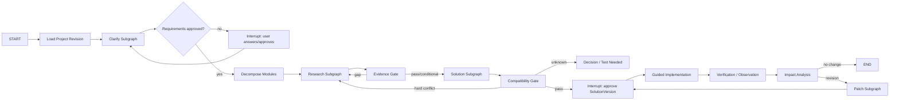

# Aidison Agent 与 LangGraph 工作流

- Status: sealed design
- Runtime owner: LangGraph inside the Aidison-owned Deep Agents Core derivative
- Business owner: Aidison Domain
- Multi-agent default: bounded durable delegation on; dynamic self-created swarm off

## 1. 设计原则

Aidison 不以长期人格化 Agent 数量定义产品。`Researcher`、`Reviewer` 或 `Solution Architect` 是任务模式和 Prompt/Profile，不是各自拥有状态、数据库和无限生命周期的独立系统。

外层必须是确定性的领域状态机；模型只能在有界节点中产生 typed Proposal。Worker 节点提交 Domain command 时必须携带 `job_id/attempt_id/claim_generation`，由数据库事务验证 fencing、cancel 与 lease，不能依赖进程内检查。

## 2. Graph 拓扑



## 3. 最小 Graph State

Graph state 只保存运行所需引用和未提交提案：

```python
class AidisonGraphState(TypedDict):
    project_id: str
    run_id: str
    base_project_revision: int
    active_solution_version_id: str | None
    stage: str
    pending_module_ids: list[str]
    current_task_ids: list[str]
    proposal_refs: list[str]
    budget: dict
    warnings: list[dict]
    interrupt_ref: str | None
```

禁止放入：完整 Evidence ledger、完整 Solution、原始大文件、用户秘密、支付信息和业务表的复制品。

## 4. Clarify Subgraph

输入：用户目标、现有资源、预算、硬约束、偏好和未知。

节点：

1. `normalize_goal`：提取明确事实与待确认推断；
2. `detect_missing_constraints`：生成最少、决策相关的问题；
3. `draft_requirement_revision`：产生 typed draft；
4. `requirement_validator`：机械检查硬/软/unknown 分离；
5. `interrupt_for_user`：用户回答并批准需求基线。

模型不能代替用户回答缺失约束。未确认项保持 unknown。

## 5. Decompose Subgraph

把已批准需求转成职责模块，而不是产品列表或 Agent 节点。每个 Module 至少包含：

- responsibility；
- inputs/outputs/interfaces；
- dependencies；
- constraints；
- acceptance；
- open questions；
- affected paths for later Patch。

V0 默认最多八个一级模块，超出时要求合并或用户确认，避免无限拆分。

## 6. Research Subgraph

采用 DeepResearch 学习资料和旧论文研究中最稳定的局部机制：

```text
plan questions
 -> bounded web/local fan-out
 -> fetch stable snapshots
 -> select exact spans
 -> normalize propositions
 -> bind claims/evidence/counterevidence
 -> audit coverage/conflicts
 -> reflect: stop or one bounded gap round
 -> synthesis proposal
```

### 节点契约

- `research_planner`：最多生成有界问题集和预算，不直接搜索；
- `source_discovery`：只返回 DiscoveryHit；
- `source_fetcher`：获取内容、hash、版本和观察时间；
- `span_selector`：生成可定位片段；
- `evidence_normalizer`：生成 Proposition/Claim candidate；
- `evidence_auditor`：检查引用、范围、反证和冲突；
- `reflect_stop_policy`：机械预算 + 证据缺口 + evaluator；
- `research_synthesizer`：生成 typed findings proposal。

V0 最多两个并行只读 ResearchTask。动态 deep/wide/entity 策略默认关闭，只有消融证明收益后启用。

## 7. Solution Subgraph

1. `candidate_normalizer`：候选身份与 revision 去重；
2. `constraint_matcher`：硬约束机械过滤；
3. `compatibility_evaluator`：模块内和跨模块 finding；
4. `conflict_resolver`：保留 incompatible/conditional/unknown；
5. `bom_builder`：建立 GenericPartRequirement 与 selected candidate；
6. `implementation_planner`：形成步骤、前置、回退和验证；
7. `risk_synthesizer`：总结但不覆盖底层 finding；
8. `solution_gate`：决定进入补研、测试、用户 Decision 或批准。

模型不得把缺少数据的兼容性标为 compatible。安全、预算、精确接口和已知规则由 deterministic gate 决定。

## 8. Decision 与 HITL

每个 `DecisionRequest` 绑定：

- exact aggregate/version；
- options；
- consequences；
- evidence and counterevidence；
- unknowns；
- affected modules；
- expiry/freshness；
- required approval level。

LangGraph `interrupt()` 只暂停运行；Decision 的业务记录由 Domain command 提交。恢复时重新检查 basis hash 与 project revision，旧批准不能套用到已变化的方案。

## 9. Observation 与 Patch

用户反馈先保存为不可变 `Observation`，然后：

```text
Observation
 -> dependency-aware ImpactAnalysis
 -> directly affected modules
 -> transitively affected modules
 -> reusable unaffected modules
 -> stale claims/evidence/findings
 -> proposed revision scope
 -> user approval
 -> bounded reopen/research
 -> PatchSet(base_solution_version_id)
 -> new SolutionVersion
```

Patch 必须使用 expected old value/revision，全有或全无；不能修改锁定路径或原地改变旧版本。

## 10. Tool Broker

工具分四级：

| Level | Examples | Default |
|---|---|---|
| discovery | web search, catalog query | allowed with budget |
| read | fetch URL, parse document, inspect artifact | allowed with SSRF/path controls |
| write | sandbox file, project draft artifact | approval/policy dependent |
| external/physical effect | order, payment, device action, host shell | disabled in V0; explicit gate required later |

每次调用形成 typed `ToolAttempt`、normalized error、effect state 和 receipt。外部结果为 ambiguous 时进入人工 reconcile。

## 11. Model Provider 使用

Graph 节点声明能力和角色，不写死模型名：

```text
role = reasoning_primary | general | economy | vision
requires = {text, tools, streaming, json_object, ...}
```

Router 先按 capability/region/data policy 硬过滤，再按质量、预算和健康状态选择 OpenAI 或百炼。Provider continuation 失效时从 canonical input 重放。

## 12. Retry、取消与预算

- 401/403、invalid schema、billing、quota、policy denial 不自动重试；
- timeout、connection、部分 429/5xx 做 bounded retry + jitter；
- provider fallback 必须重新从 canonical state 构建请求；
- 已有副作用时禁止透明 fallback/replay；
- partial stream 属于失败 Attempt，新 Attempt 不与旧 delta 拼接；
- cancel 先标记 Aidison Job，再尽力取消 provider；provider 不支持取消时忽略迟到结果。

预算至少包括 input/output token、model calls、tool calls、deadline 和可选 cost ceiling。超预算进入 `decision_required` 或显式降级，不能静默削减关键研究。

## 13. 事件与可观察性

前端只接收可验证执行摘要：

- node/task started/completed/failed；
- source discovered/fetched/rejected；
- evidence supported/contradicted/stale；
- decision required/resolved；
- solution frozen/superseded；
- verification passed/failed；
- retry/fallback/budget warning。

不暴露 chain-of-thought、模型内部草稿、密钥、完整地址或未过滤工具参数。

## 14. 关键测试

- graph route/gate golden tests；
- interrupt/restart/resume；
- node re-execution + idempotent domain commit；
- stale subagent rejection；
- evidence snapshot/span integrity；
- unresolved hard conflict blocks activation；
- solution immutability and Patch CAS；
- provider stream reducer and error mapping；
- cancel/late-result discard；
- matched-budget single vs two research workers。

## 15. 多智能体完整契约

本文件的 graph/node 是业务工作流视图；`MULTI_AGENT_ORCHESTRATION.md` 是 Agent Profile、durable delegation、child Job、fan-in、fencing、cancel、evaluator 和 promotion 的 canonical design。

V0 必须实现版本化 `AgentProfile`、`DelegationSpec/Result`、`JoinPolicy/Receipt` 和 parent `waiting_children`。最多两个只读 child；Agent 不能递归创建 Agent，也不能写 canonical/preference/procedural memory。Proposal 与 join 接纳同样验证 parent/child generation、basis hash、Profile revision、预算、artifact hash 和 cancel 状态。

任何迟到、旧 generation、旧 basis 或 schema 不合格的 child result 都进入 episodic quarantine；它可以用于故障分析，但不能参与 merged proposal。多 Agent 能力只有通过相同 provider/tool/全局预算的 fixture ablation，且无安全、成本或延迟回归，才允许从 V0 静态策略晋升。

Context assembly 与七层记忆的 owner、写入晋升、检索和失效见 `MEMORY_SYSTEM.md`；Graph state 仍只保存 refs，不复制这些记忆。
