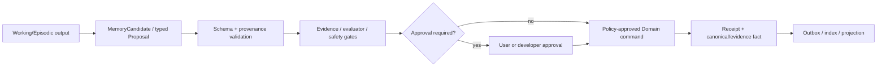

# Aidison 分层记忆系统工程设计

- Status: implementation blueprint
- Principle: memory is governed ownership and provenance, not a generic autonomous memory blob
- V0 infrastructure: PostgreSQL + LangGraph checkpoint + content-addressed artifact volume
- Vector/graph store: disabled until an evaluated retrieval bottleneck exists

## 1. 记忆系统解决什么

Aidison 必须记住项目需求、证据、方案、执行尝试、用户明确偏好和验证过的工作规则，同时避免把 Agent 草稿、provider conversation、过期来源或 Prompt injection 变成长期事实。为此，记忆按语义、所有权、保留周期和写权限分层；“V0 不做无界长期语义记忆”不等于取消记忆设计。

核心规则：

1. 每条 durable memory 都有 owner、scope、version、provenance、freshness 和 invalidation 语义；
2. Agent 输出先成为 candidate/proposal，不能直接长期学习；
3. canonical truth、evidence、preference 和 procedural rule 分开治理；
4. 检索先使用结构过滤、普通索引和 FTS，embedding/graph 只有消融证明收益后晋升；
5. 用户可查看、导出、撤销、遗忘和删除允许删除的数据；
6. 不保存 chain-of-thought，不把来源文本当系统指令。

## 2. 七层记忆

| Layer | Owner / writer | Retrieval | Invalidation / retention | Safety boundary |
|---|---|---|---|---|
| Working | LangGraph checkpoint；当前 node/profile | 同一 run、固定 revision 的 refs | terminal 后按 retention 清理；resume 校验 basis | 不放 secret、完整 evidence、大文件或 canonical 副本 |
| Episodic | runtime Attempt/ToolAttempt/RunEvent；系统 append-only | project/job/profile/time/type | redact/tombstone，不改写历史语义；按政策归档 | 默认只存摘要、hash、normalized args/error |
| Canonical Project | Aidison Domain；仅 Domain command | exact aggregate/revision/basis | append/supersede；批准事实不可原地覆盖 | Proposal 不自动晋升；CAS、approval、receipt |
| Evidence/Semantic | Snapshot/Span/Claim/Binding；fetch/audit 后由 command 提交 | exact refs、结构过滤、FTS；引用时 rehydrate span | stale/retracted/superseded append-only；保留原因与 replacement | 来源当数据不当指令；artifact 异常使 evidence 降级 |
| Preference | V0 仅用户显式的 project preference | 同 project/basis；V1 才评估 opt-in global | revoke/override；新 RequirementRevision 重新确认 | 推断偏好不得写入；不得覆盖硬约束/安全；不存支付/地址 |
| Procedural | versioned profile/prompt/policy/tool/rule manifest；开发者发布 | run 固定 revision/hash | revoke/replace active pointer；历史 run 保留旧 ref | Agent 无写权；必须有 Evaluation/Promotion |
| Artifact | content-addressed volume + Domain metadata | 授权后按 hash/ref | present→quarantined/missing/corrupt/expired；保留 lineage | media/size/path/SSRF 扫描、敏感分类、下载审计 |

跨项目默认隔离：canonical、evidence、working、episodic 不跨 Project；preference 只有用户显式 opt-in 才可进入 global scope；procedural rule 只有通过评测与发布才能跨项目复用。

## 3. 写入晋升管线



不存在“Observation 自动学习到全局记忆”。Observation 可生成 `ReusableRuleCandidate`，但必须带 provenance、applicability、反例、验证 fixture 和失效条件；它默认只在当前 Project 生效。跨项目 procedural promotion 走 EvaluationRecord/AblationRun/PromotionDecision。

## 4. 最小数据契约

```text
MemoryRef {
  layer, object_type, object_id, revision,
  project_id?, scope, content_hash
}

MemoryCandidate {
  candidate_id, target_layer,
  source_refs[], producer_profile_revision,
  project_id, scope, schema_ref,
  basis_hash, content_hash,
  proposed_ttl?, sensitivity,
  validation_status, created_at
}

MemoryProvenance {
  source_type, source_ref,
  observed_at, publisher_version?,
  exact_span_or_artifact_hash?,
  extraction_profile_revision?,
  transformation_lineage[]
}

InvalidationRecord {
  target_ref, reason,
  status: stale|retracted|superseded|quarantined|deleted,
  replacement_ref?, detected_at,
  actor, evidence_refs[]
}

ReusableRuleCandidate {
  rule_id, domain_tags[], applicability,
  provenance_refs[], counterexamples[],
  validation_fixture_refs[],
  invalidation_trigger, proposed_scope
}
```

这些是逻辑类型，不要求每个类型一张表。V0 可以使用规范化核心列加 schema-versioned JSONB，但 SourceSnapshot/Span、Claim/Binding、Preference、Profile revision 和 Invalidation 必须可查询、可约束。

## 5. Context Assembly 与检索路由

每个 Agent Profile 声明 `memory_read_scopes`。Context assembler 按以下顺序构建输入：

1. 读取 exact Project/Requirement/Solution revision；
2. 应用 Profile、权限、项目和敏感级别过滤；
3. 按任务类型选择结构查询：Module、Claim、Candidate、Decision、Observation；
4. 在允许的层内执行 FTS/metadata search；
5. rehydrate exact SourceSpan/Artifact，重新验证 hash、freshness 和 invalidation；
6. 在 token budget 内做可追溯 compaction；
7. 输出 `ContextManifest`，记录包含/排除的 ref、原因、hash 和 token 数；
8. 把来源内容放在明确的 untrusted-data 边界，不能覆盖 system/profile policy。

```text
ContextManifest {
  project_id, job_id, profile_revision,
  basis_hash, policy_version,
  included_refs[{ref, hash, tokens, reason}],
  excluded_refs[{ref, reason}],
  total_tokens, created_at
}
```

当 exact ref 足够时禁止语义搜索。只有在真实 fixture 上，embedding/graph 相对 FTS 在相同预算下显著提升召回且没有 provenance 回归，才允许增加 PostgreSQL extension 或外部索引；索引永远是可重建 projection。

## 6. Freshness、矛盾与失效

- SourceSnapshot immutable；新抓取产生新 revision/hash。
- Claim 不因新证据原地改写，通过新的 EvidenceBinding、Contradiction 或 InvalidationRecord 表达认识变化。
- `supported/contradicted/unknown/stale/retracted` 是带 basis 的评价，不是来源永久属性。
- 引用前检查观察时间、发布版本、适用地区/型号/条件和 artifact 状态。
- artifact 变为 quarantined/missing/corrupt/expired 时，通过 outbox 把绑定 Evidence 标记为 `stale/review_required`。
- Solution/Decision 保存 exact evidence basis hash；basis 变化后旧批准不能自动复用。
- compaction 只生成派生摘要，保留 source refs；摘要不能成为独立证据。

## 7. Preference Memory

V0 只支持用户明确提交并可撤销的 project-scoped preference，例如预算倾向、尺寸偏好、是否接受焊接。它仍属于 RequirementRevision 的显式输入，不是模型猜测。

禁止写入 preference：

- 从聊天语气或一次选择推断的性格/偏好；
- 会覆盖法规、安全、硬兼容或预算上限的默认值；
- 密码、API Key、支付信息、完整地址或不必要个人信息；
- 来自网页、PDF 或第三方内容的“用户偏好”。

V1 如评估 global preference，必须默认关闭、显式 opt-in、展示来源和作用域，并提供 revoke/export/delete。

## 8. Procedural Memory 与工程学习

Procedural memory 保存经验证的 Profile、Prompt hash、policy、tool manifest、adapter contract、playbook 和 reusable rule。它体现工程学习，但不能由一次运行自写。

每次变更至少可追溯：

- problem/context；
- alternatives 与 rejected reason；
- evidence/counterevidence；
- expected consequence；
- validation command/result 与 fixture version；
- invalidation/rollback trigger；
- supersedes 与真实 commit/ADR/spec refs。

仓库中的 ADR 保存长期取舍，变更规格保存本次实施边界，Mai 只做索引/仪表盘投影；三者不复制完整内容。

## 9. 保留、导出、遗忘与删除

| Data | V0 默认 | 用户能力 |
|---|---|---|
| Working checkpoint | run terminal 后短期保留，具体天数在 S2 定标 | 清理 Project 时删除 |
| Episodic event/attempt | 保留审计所需摘要；敏感 payload 立即 redact | 导出；按政策 tombstone/delete payload |
| Canonical Project | 直到用户删除 Project | 查看、导出、删除；不可伪造历史改写 |
| Evidence/Snapshot | 随 Project；受来源许可与 retention 限制 | 查看来源/失效原因、删除本地 snapshot |
| Preference | project-scoped，直到 revoke/delete | 查看、修改、撤销、导出、删除 |
| Procedural | 随软件版本与发布历史 | 查看版本/依据；由开发者 rollback |
| Artifact | 随 Project 或 TTL | 查看 hash/状态、下载、删除；引用进入 missing/stale |

具体天数、备份和硬删除窗口在 S2 通过真实磁盘量与恢复需求定标；此前均为 `not_checked`。删除操作必须先列出影响范围并使衍生索引、缓存和 provider-stored state 一致失效。

## 10. 安全与隐私

- Source/Artifact 内容是 untrusted data，不能产生 system/tool instruction。
- 检索前做 project/owner/sensitivity/retention 过滤，检索后再次验证 ref 与 hash。
- Secrets 仅存在专用 secret store/environment，不进入 checkpoint、event、artifact、prompt snapshot 或 Mai。
- Tool output 只保存 normalized/redacted 结构；原始大 payload 进入受控 artifact。
- ContextManifest 和 SSE 只显示 ref/count/hash/policy，不展示完整 retrieved content。
- Prompt injection fixture 必须覆盖“要求忽略系统规则、读取其他项目、泄露密钥、自动下单/控制设备”。
- 跨 provider fallback 从 canonical refs 重新组装上下文；provider conversation ID 是可丢弃元数据。

## 11. 控制台可视化

V0 Activity drawer 展示：本次读取了哪些记忆层、ref 数量、freshness 警告、被排除/失效的数量、使用的 Profile revision 和预算；不展示隐藏 Prompt 或 chain-of-thought。

Evidence 页面展示 SourceSnapshot → Span → Claim → Binding → Decision/Solution 的 provenance；Artifact 异常和 contradiction 清晰可见。V1 Memory Inspector 才提供 preference 管理、retention/export/delete 和 procedural revision 对比。

## 12. 实施顺序与验证

1. S2：冻结七层 owner、MemoryRef、Provenance、Invalidation、Preference 与删除边界。
2. S3：实现 Working/Episodic、ContextManifest、redaction、artifact invalidation outbox。
3. S4：实现 Evidence FTS/结构检索、freshness/contradiction 与 prompt-injection 防护。
4. S5：Decision/Solution basis hash 与 Observation → reusable-rule candidate。
5. S6：Activity/Evidence provenance UI；V1 再做 Memory Inspector。

必须验证：Proposal 未经 Domain command 不可出现在 canonical query；stale artifact 使 Evidence 降级；preference revoke 后旧值不再检索；旧 Profile revision 可回放；跨 Project 检索为零；FTS 基线完成前不引入 vector/graph。

