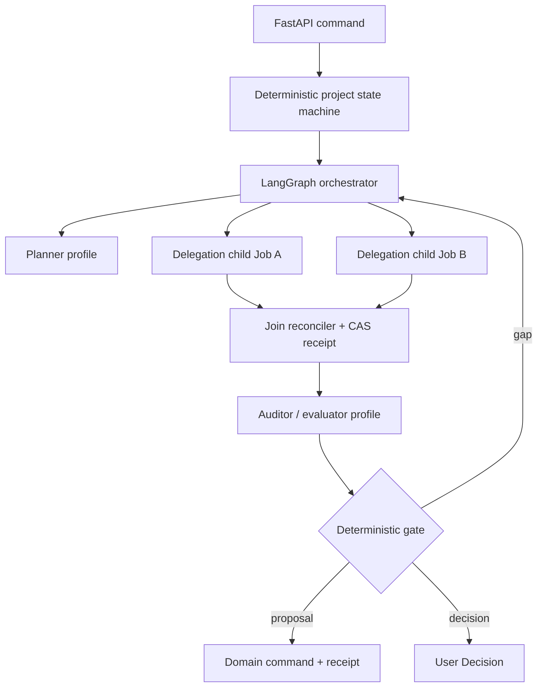

# Aidison 多智能体编排工程设计

- Status: implementation blueprint
- Runtime: one LangGraph runtime inside the Aidison-owned Deep Agents Core derivative
- Durable execution: Aidison Job/Attempt/Delegation tables in PostgreSQL
- Canonical truth: Aidison Domain, never Agent state or provider conversation
- First real pilot: 四旋翼无人机；核心仍必须对任意 DIY 通用

## 1. 目标与边界

Aidison 的多智能体不是“多放几个 Prompt”，也不是让多个长期人格各自拥有记忆。它是一个可恢复、可审计、可取消、可评测的任务编排系统：确定性外层状态机把工作委派给版本化 Agent Profile；每个 Worker 只生成 typed Proposal、EvidenceCandidate 或 staged Artifact；只有 Domain command 能把通过门禁的结果写入业务事实。

必须同时满足：

1. 多 Agent 复用并按需修改 Deep Agents/LangGraph 的 graph、subagent、checkpoint、stream、tool、middleware 和 backend 骨架；
2. parent/child、fan-out/fan-in、lease、fencing、retry、cancel 和 late result 有持久语义；
3. Agent 数量和策略由任务收益决定，而不是由可用并发槽决定；
4. evaluator 与 matched-budget ablation 决定能力晋升，不能由一次自评自动“学习”；
5. UI 能解释谁被委派、为什么、花了多少预算、哪些结果被接纳或拒绝；
6. 不引入第二 Agent runtime、第二任务队列或第二业务事实源。

## 2. 从参考项目继承什么

| Donor | 继承/深改 | 不继承 |
|---|---|---|
| Deep Agents | LangGraph harness、subagent executor、checkpoint、stream、tool/middleware/backend 边界；映射为持久 Delegation/child Job | Graph/Message/File 业务真相、无 attempt 的 async task、无界 subagent |
| DeepResearch | plan → bounded fan-out → evidence audit → reflect → write | 预算只写在 Prompt、无快照证据、8 个常驻角色 |
| CloudAgent | typed state、role/tool/API 分层 | 自然语言 handoff、云客服角色、Redis/Milvus/Neo4j 多真相 |
| LoopX / Symphony | lease、claim generation、reconcile、capacity、retry、writeback/ack | 独立 daemon 或第二调度器 |
| InfoSeeker | Host → Manager → Worker 的职责分层 | busy flag 队列、无限层级委派 |
| WebSwarm | atom/deep/wide/entity 策略候选 | 默认动态 swarm |
| MiroFlow | normalized failure、FailureArtifact、重试边界 | 非持久的隐式失败处理 |
| CORAL | evaluator、attempt lineage、可比较分数 | 在线自我晋升和单模型自证 |
| ScaffoldAgent | outline expand/contract/revise 的 bounded patch | outline 充当 canonical truth |
| OpenAI Agents SDK | typed handoff、guardrail、工具权限的契约观念 | 第二 Runner、Session 业务真相 |

## 3. 两层编排



- 外层决定项目阶段、批准、预算、硬兼容、安全和副作用权限。
- 内层 Agent Profile 负责需要认知判断的有界任务。
- Router、compatibility hard gate、budget gate、approval gate 和 Tool Broker 不是 Agent。
- V0 child 不允许递归创建 child；只有 orchestrator 能发起 delegation。

## 4. Agent Profile Registry

Profile 是不可变、版本化的 procedural memory，不是常驻人格。

```text
AgentProfile {
  profile_id, revision, purpose,
  input_schema_ref, output_schema_ref,
  allowed_tool_classes, effect_ceiling,
  memory_read_scopes, memory_write_scopes,
  model_capabilities,
  budget_caps, concurrency_cap, timeout,
  retry_policy_ref, evaluator_policy_ref,
  prompt_hash, status
}
```

运行时固定 `profile_id + revision + prompt_hash`。active pointer 的变化只影响新 run；旧 run 必须可按原 revision 回放。

| 版本 | Profile | 权限与目的 |
|---|---|---|
| V0 | `clarification_proposer` | 把输入变成 RequirementRevision draft；无事实写权 |
| V0 | `research_planner` | 生成有界问题、分片与总预算；不搜索 |
| V0 | `research_worker_ro` | discovery/read、快照和 EvidenceCandidate；每个 parent 最多两个该 Profile 的 child/实例 |
| V0 | `evidence_auditor` | 查引用、反证、冲突、freshness；不通过多数票消除冲突 |
| V0 | `solution_proposer` | Candidate/Compatibility/BOM/Verification typed proposal |
| V0 | `impact_proposer` | 基于 Observation 提出受影响闭包与 PatchSet draft |
| V1 | `research_strategy_manager` | 在已晋升的 atom/deep/wide 策略中选择；不得自由造 Agent |
| V1 | `verification_interpreter` | 解释用户上传的验证结果，底层 pass/fail 仍由规则决定 |
| V1 | `shopping_researcher_ro` | 搜索 Offer/政策/库存快照；不能下单或保存支付数据 |
| V2 | `specialist_researcher` | 按领域标签加载已发布的 procedural rule |
| V2 | `critic_evaluator` | 按冻结 oracle/fixture 评测候选结果 |
| V2 | `action_planner` | 只生成外部动作 Proposal；Tool Broker 才能执行批准动作 |

V0 Agent 不可写 canonical、preference 或 procedural memory。`research_worker_ro` 只允许 discovery/read 和 staged artifact。

## 5. Typed Delegation

每次 delegation 对应一个 durable child Job，复用现有 Job runtime，不另建队列。

```text
DelegationSpec {
  delegation_id, parent_job_id, parent_attempt_id,
  parent_claim_generation, graph_step_id,
  profile_id, profile_revision,
  input_refs[], basis_hash,
  scope, allowed_effects, canonical_write=false,
  budget, deadline,
  join_group_id, shard_key,
  idempotency_key, cancel_policy
}

DelegationResult {
  delegation_id, child_job_id, attempt_id,
  child_claim_generation,
  status: succeeded|failed|cancelled|stale|ambiguous,
  proposal_ref?, staged_artifact_refs[],
  evidence_candidate_refs[],
  basis_hash, usage, warnings[], normalized_error?
}

JoinPolicy {
  mode: all_required|bounded_partial,
  expected_delegation_ids[], min_successes,
  conflict_policy: preserve,
  deadline, total_budget
}

JoinReceipt {
  join_group_id, accepted_result_hashes[],
  rejected_results[{ref, reason}],
  merged_proposal_ref, basis_hash, committed_at
}
```

V0 限制：`max_children=2`；只允许 `all_required` 或显式 `bounded_partial`；不允许 first-wins、majority-vote、递归 delegation。`(parent_attempt_id, graph_step_id, shard_key)` 唯一，重复 fan-out 返回原 delegation；join 使用 CAS，最多生成一个 JoinReceipt。

## 6. Durable fan-out / fan-in

```text
parent running
 -> atomic create child jobs + delegations
 -> parent waiting_children
 -> children terminal
 -> join reconciler validates each result
 -> one JoinReceipt
 -> parent queued with new claim_generation
```

父 Job 进入 `waiting_children` 时释放 worker lease，但保留 join generation。接纳 child result 必须同时验证：

- parent/child identity、attempt 与 claim generation；
- parent 未 cancel/terminal；
- delegation/profile revision、`basis_hash` 与 expected project/requirement revision；
- deadline、全局预算与 effect ceiling；
- result schema、artifact hash 与安全扫描；
- result 未被先前 JoinReceipt 消费。

不合格或迟到结果写入 episodic history 并标为 `stale/rejected`，不得进入 merged proposal。

## 7. Lease、fencing、retry 与 cancel

- child Job 有独立 lease/generation；parent resume 生成新的 claim generation。
- Domain command、Proposal 接纳和 JoinReceipt 三处都必须验证 fencing；不能只保护最终数据库写入。
- 同一 delegation retry 保持 `delegation_id`，新增 `attempt_id/attempt_no`。
- retry 消耗 parent 全局预算；不能为每个 child 重新得到完整预算。
- 只有无副作用或明确 `delivery_state=not_sent` 的 transient failure 自动重试。
- 外部副作用 delivery unknown 时为 `ambiguous`，禁止透明 fallback/retry。
- parent cancel 在事务内把所有非 terminal descendants 标为 `cancel_requested`。
- cancel 后只有取消前已存在有效 Domain receipt 的事实允许 projector/reconciler 收尾。
- parent generation 或 basis 失效后到达的 child 只做 quarantine，不唤醒 parent。

## 8. Capability routing 与预算

Profile 声明能力，不写死模型：`text/tools/streaming/typed_output/vision/context_window/region/data_policy`。Router 先硬过滤，再按健康、质量、成本和延迟选择 OpenAI 或百炼。provider fallback 必须从 canonical refs 重建请求，不能传递另一 provider 的 conversation ID。

预算在 parent 创建 delegation 前保留：

```text
global = token + model_call + tool_call + wall_clock + optional_cost
child allocation <= remaining global budget
retry allocation consumes the same reservation
join/audit reserve cannot be spent by workers
```

超预算进入 `decision_required`、`bounded_partial` 或明确降级；不能静默跳过关键证据审计。

## 9. Evaluator、Ablation 与 Promotion

```text
EvaluationRecord {
  evaluation_id, subject_type, subject_ref, subject_hash,
  evaluator_profile_id, evaluator_revision,
  oracle_set_id, oracle_set_version,
  hard_gate_results[], metric_scores[],
  confidence_or_variance,
  grader_status: valid|invalid|timeout|partial|suspected_cheating,
  usage, artifact_refs[]
}

AblationRun {
  baseline_profile_revision, candidate_profile_revision,
  fixture_set_version, provider/model/tool snapshot,
  equal_global_budget, repetitions, seed_set,
  metrics, regressions, cost, latency
}

PromotionDecision {
  candidate_revision, baseline_revision,
  predeclared_threshold_ref, evaluation_refs[],
  decision: promote|hold|reject|rollback,
  approved_by, activated_at, rollback_target
}
```

- V0 建 schema、fixture oracle 和 mutation tests，不做在线自我晋升。
- V1 对 two-worker、manager、购物研究等逐项做 matched-budget ablation。
- 晋升必须满足预先阈值、无 hard-gate/security 回归、成本/延迟上限，并保留 active pointer 回退。
- 单模型自评、一次 pilot 或平均分上升不能晋升。

## 10. Observable event contract

所有事件包含：

```text
event_id, project_seq, occurred_at,
causation_id, correlation_id,
job_id, attempt_id,
delegation_id?, join_group_id?,
profile_id?, profile_revision?, basis_hash?,
visibility, redaction_policy_version,
usage_delta?, artifact_refs[]
```

新增语义事件：

```text
delegation.created|claimed|started|completed|failed|cancel_requested|rejected_stale
join.waiting|ready|committed|partial|cancelled
evaluation.recorded|invalid|ablation.completed
profile.promoted|rolled_back
budget.reserved|consumed|exhausted
```

UI 只显示执行摘要、输入引用、预算、结果状态和接纳/拒绝原因；不显示 chain-of-thought、完整 Prompt、秘密或原始检索上下文。

## 11. 四旋翼 pilot 的通用性门

- 电压、推重比、桨叶、飞控协议只能作为 Requirement、Module interface、CompatibilityFinding、Evidence 或带适用范围的 procedural rule 数据出现。
- 不允许新增 `Drone*` 核心实体、graph edge、Agent Profile 或硬编码 tool route。
- pilot 衍生规则必须带 `domain_tag/provenance/version/applicability`，默认只在该 Project 生效。
- pilot 修改核心 contract 后，立即重跑至少一个机械 fixture 和一个非无人机软硬件 fixture。
- 物理装配与试飞属于 user-executed Verification；V0/V1 不自动控制设备。

## 12. 实施顺序与门禁

1. S0：固定 Deep Agents Core SHA，验证其 subagent executor 能否映射 child Job；完成“两 child → crash/one stale → single JoinReceipt”spike。
2. S2：冻结 Profile、Delegation、Join、Event schema 与 Domain write boundary。
3. S3：实现 waiting_children、fencing、cancel propagation、join reconciler 和 replayable events。
4. S4：实现两个只读 Research worker、Evidence auditor 和 EvaluationRecord。
5. S5–S7：用 single vs two-worker matched-budget fixture、故障注入和四旋翼 pilot 验证。

任一门禁失败时先降为单 worker/顺序执行；不以第二队列、第二 runtime 或无界递归修补。
